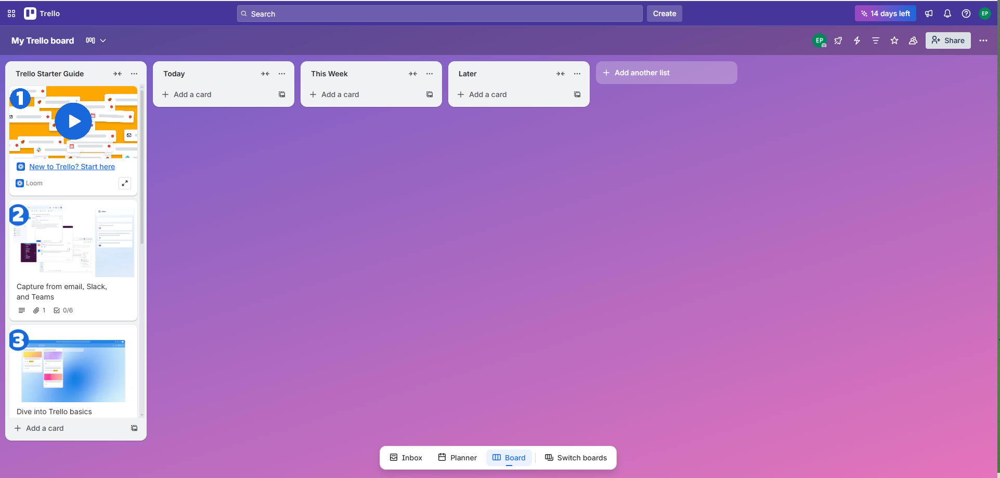

**Table of Contents:**

- [What exaclty is Postman??](#what-exaclty-is-postman)
- [Install Postman first](#install-postman-first)
- [API Example Setup](#api-example-setup)
  - [Create Your Trello Account](#create-your-trello-account)
  - [Trello's API](#trellos-api)
  - [Trello's Power Up, API Key and Token](#trellos-power-up-api-key-and-token)
- [Roll up our sleeves](#roll-up-our-sleeves)

## What exaclty is Postman??
Postman is an all-in-one API platform used not only by developers, but also by testers. It helps us build, test, and manage APIs in a simple and intuitive way.
Sounds good, right?

This amazing tool streamlines the entire API lifecycle by providing a clean, user-friendly interface where you can:

👉 Send and inspect HTTP requests

👉 Test API behavior using automated scripts

👉 Organize and document your work

👉 Collaborate easily with your team

👉 Monitor API performance over time

In short: Postman makes working with APIs easier, faster, and much more pleasant,  whether you're a beginner or an experienced QA.

Learning how to use a new platform doesn’t have to be a daunting task.

Sure, sometimes it feels overwhelming at first, but when we break things down and explain them in a simple, practical way, everything becomes much easier. 
And the best part? The knowledge sticks.

So, with that spirit in mind, let’s walk through how to use Postman, step by step, in a friendly and straightforward way.

## Install Postman first

Before we start, we ’ll need to install Postman (of course!! otherwise we wouldn’t be able to do anything, and we wouldn’t be able to get our hands dirty like we love! 😄)

Just type “Postman” into Google’s search bar and click on the first link that appears, or go directly to their official website: [Postman](https://www.postman.com/)

Once you're there, choose your operating system, select the correct system type, and the installer (.exe, .dmg, etc.) will start downloading automatically.

After the installer has finished downloading, run it and follow the installation steps.
You can safely go with the default settings, nothing complicated here.

And… tcha-naaaam!! 🎉🎉

Postman is installed, and you’re now ready to explore this powerful tool, test APIs, and hunt down even the most mysterious bugs.

## API Example Setup

### Create Your Trello Account

To show you how to use Postman, I’m going to use the Trello REST APIs as an example.
Of course, you can use any other API you prefer, the way we use Postman will be exactly (or almost) the same.

Before we start playing with Trello’s REST API in Postman, you’ll need to have your own Trello account.

No account → no boards → no API access. Simple as that.

Here’s what to do:
1. Go to [Trello](https://trello.com/)
2. Click on “Get Trello for free”
3. Enter your email address
4. Click Sign Up
5. Follow the usual steps you’d take when creating an account and choose the options that best fit your needs (Don’t Forget to verify your email!!!!!)

This is what you’ll see once you verify your email and log in to your Trello account:

To create a new board, cards, or anything else in Trello, you can do it manually, or you can do it through Trello’s APIs almost automatically.
And this is where Postman comes in. It allows you to do all of this in a simple and easy way, while also helping you understand how APIs work and how to test them effectively.
To learn how to do this, just check the [Roll up our sleeves section](#roll-up-our-sleeves)

### Trello's API

To learn how Trello’s APIs work, just type “Trello API” into Google’s search bar and click on the first link that appears, or go directly to their official documentation [Trello's API](https://developer.atlassian.com/cloud/trello/rest/).

Here you’ll find an excellent manual explaining how [Trello's API](https://developer.atlassian.com/cloud/trello/rest/) works.
On the left-hand menu, you’ll see all the available features and their corresponding API methods (GET, PUT, POST, DELETE, etc.) that you can use through Postman.

### Trello's Power Up, API Key and Token

Before we start making any calls, we need to create a Trello's Power-Up and then generate our API key and token.
To create both, just follow the instructions in the [official guide](#https://developer.atlassian.com/cloud/trello/guides/rest-api/api-introduction/).

## Roll up our sleeves

